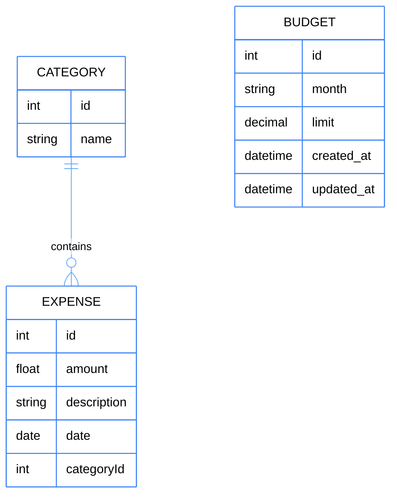

# System Zarządzania Budrzetem API

Prosty backend do zarządzania wydatkami użytkownika.

## Tech Stack
- Node.js
- Express
- MySQL
- Sequelize

## Funkcje
- Dodawanie wydatków
- Lista wydatków
- Edycja wydatków
- Usuwanie wydatków
- Kategorie zmiana

## Instalacja

## Uruchomienie

npm start
(docker compose up)

## Testy

npm test

## Architektura

# Database Schema

## API
https://github.com/AdamFor235/Projekt/blob/main/API.md

## Railway link 
https://twoj-backend-production.up.railway.app:8080/