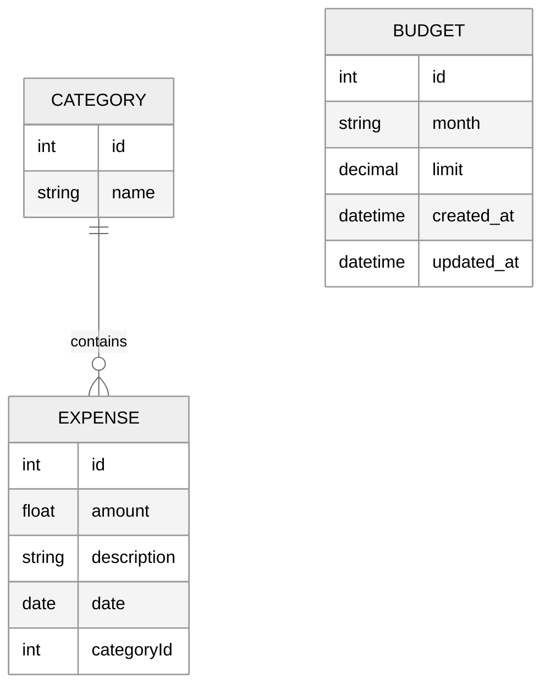

# System Zarządzania Budrzetem API

Prosty backend do zarządzania wydatkami użytkownika.

## Tech Stack
- Node.js
  Node.js został wykorzystany jako środowisko uruchomieniowe aplikacji. Umożliwia wykonywanie kodu JavaScript po stronie serwera, zapewniając wysoką wydajność i wiele bibliotek dostępnych za pośrednictwem menedżera npm.
- Express
  Express.js pełni rolę frameworka backendowego odpowiedzialnego za obsługę żądań HTTP, definiowanie endpointów API. Dzięki swojej prostocie pozwala na szybkie tworzenie aplikacji opartych o architekturę REST.
- MySQL
  MySQL jest relacyjnym systemem zarządzania bazą danych wykorzystywanym do przechowywania informacji o wydatkach. Dane są organizowane w tabelach połączonych odpowiednimi relacjami.
- Sequelize
  Sequelize jest biblioteką ORM (Object Relational Mapping), która umożliwia komunikację aplikacji z bazą danych MySQL przy użyciu obiektów JavaScript. Dzięki temu możliwe jest definiowanie modeli danych, relacji oraz wykonywanie operacji CRUD bez konieczności pisania surowych zapytań SQL.
- Docker
  Docker został użyty do konteneryzacji aplikacji. Dzięki temu możliwe jest uruchamianie projektu w identycznym środowisku niezależnie od systemu operacyjnego. W projekcie wykorzystano plik Dockerfile opisujący proces budowania obrazu aplikacji.
- Docker Compose
  Docker Compose służy do lokalnego uruchamiania wielu usług jednocześnie. W projekcie wykorzystywany jest do uruchamiania aplikacji, bazy danych MySQL oraz środowiska testowego przy pomocy jednego pliku konfiguracyjnego.
- Jest
  frameworkiem testowym wykorzystywanym do tworzenia oraz uruchamiania testów jednostkowych i integracyjnych. Pozwala na automatyczną weryfikację poprawności działania aplikacji oraz generowanie raportów pokrycia kodu testami.
- Supertest
  Supertest umożliwia testowanie endpointów REST API bez konieczności uruchamiania zewnętrznego klienta HTTP. Biblioteka została wykorzystana do testów integracyjnych sprawdzających poprawność działania interfejsu API.
- ESLint
  ESLint odpowiada za analizę statyczną kodu źródłowego. Narzędzie pomaga wykrywać błędy programistyczne oraz wymusza stosowanie spójnego stylu kodowania.
- Railway
  Railway jest platformą chmurową wykorzystywaną do hostowania aplikacji oraz bazy danych MySQL. Platforma umożliwia automatyczne wdrażanie nowych wersji aplikacji bezpośrednio z repozytorium GitHub oraz zarządzanie zmiennymi środowiskowymi.

## Funkcje
- Dodawanie wydatków
- Lista wydatków
- Edycja wydatków
- Usuwanie wydatków
- Kategorie zmiana
- Budrzety
- statystyki miesięczne
- dasboard
- api zewnętrzne: kursy walut
## Uruchomienie

npm start
(docker compose up)

## Testy

npm test

## Architektura

# Database Schema

## API
https://github.com/AdamFor235/Projekt/blob/main/API.md

## Railway link 
https://projekt-production-c4f3.up.railway.app/